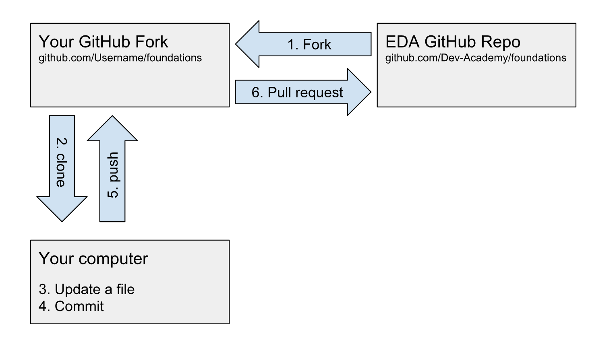

[Dashboard](../README.md) | [Resources ](README.md) |
------------|----------|

# How to Fetch Dev Academy's Curriculum Changes

Dev Academy makes modifications and edits to the curriculum often. When this happens you'll need to "fetch" the changes from Github.com into your personal repository.

Details about fetching curriculum updates are outlined in sprint-1 (see resources below).. But to recap:

## Context
1. You have already forked (created a copy of) our curriculum to your own GitHub account  
2. You cloned your copy to your computer  
3. You added a remote called `eda-remote`  
4. You need to fetch/pull down our changes from `eda-remote` into your local version  
5. You need to push those changes up to your GitHub copy  

It's important to note that __fetching changes will NOT override your work.__ On the rare occasion we do modify a 'my_solution' file, you may have a merge conflict, all you'll have to do is select which parts you want. This is not likely to happen, so don't worry about it much.

## Steps to fetching changes
1. Navigate to your __foundations__ directory using the command line.  
2. Make sure you are in the __master branch__  (run `git branch` to verify)  
3. Fetch the changes `git fetch eda-remote` (now the eda-remote's master branch is stored on your local branch eda-remote/master)  
4. Merge the branch `git merge eda-remote/master` (If you did not have any un-synced commits, git will perform a "fast-forward".)  
5. Commit the changes e.g."add EDA's changes"  
6. Push the changes to your GitHub account (`git push origin master`)  

## Additional Resource
To view Illustrations and examples, revisit Sprint 1's "Remotes and Sync Fork" [Primer](../sprint-1/git-remote-fork-merge-primer.md) and [Challenge](../sprint-1/git-remote-sync-fork-challenge.md).

Sometimes you may experience ["Merge Conflicts"!](resolving-conflicts.md)   Prepare yourself for that horrible (inevitable) moment by reading the resource.

Example illustration

<figure>
   
</figure>
