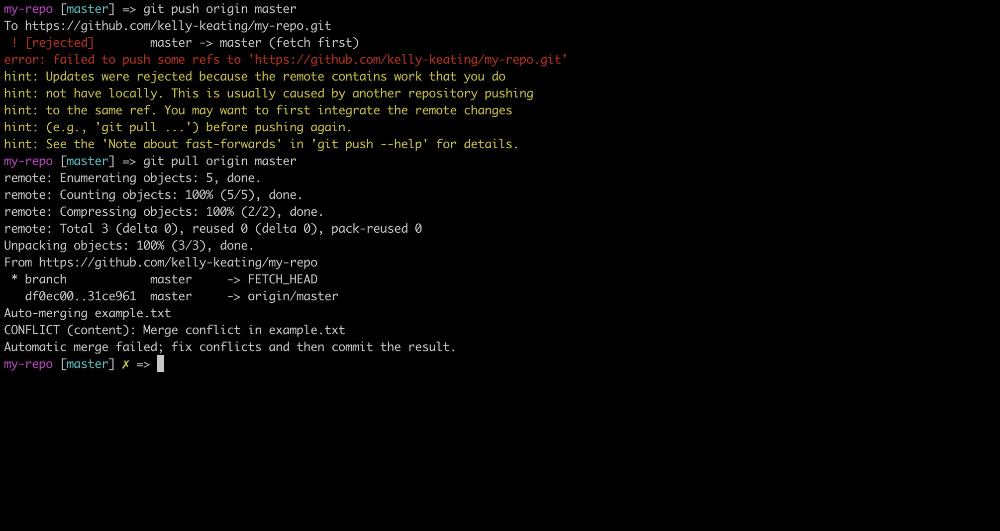
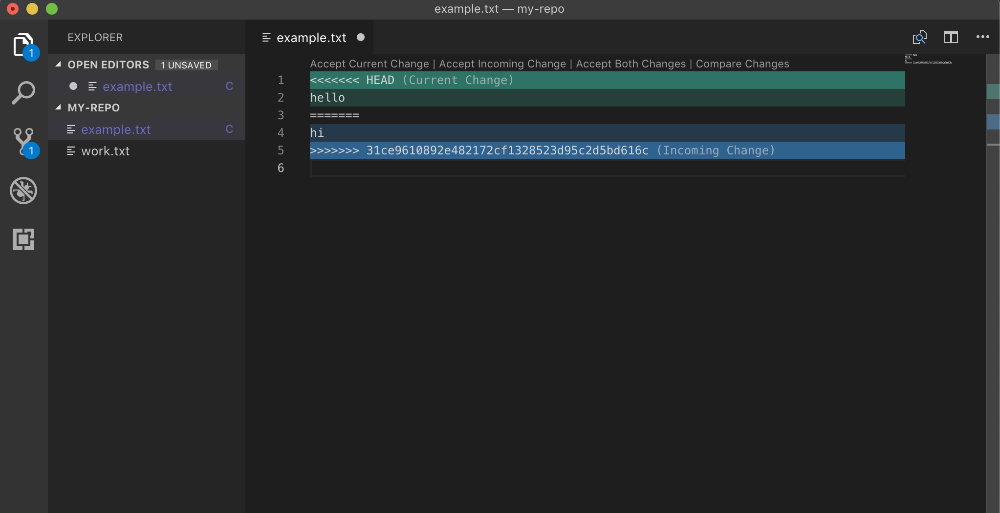
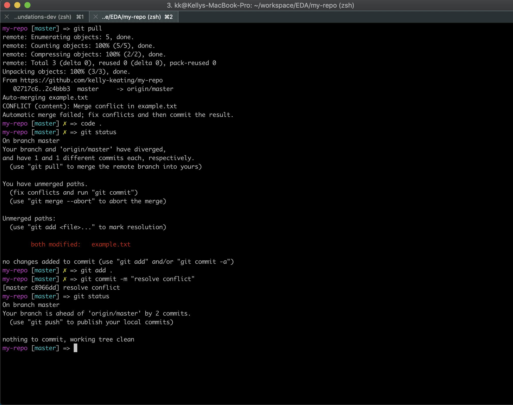

[Dashboard](../README.md) | [Resources ](README.md) |
------------|----------|

# How to Resolve Git Conflicts 

Sometimes when you `git pull` work into a repo you have been working in you will find that a file you have been working on, and making changes to has an issue when you pull. That someone else has been making changes to it too! In this situation, git isn't sure whose file it should be using and so marks the file as a conflict.

In order to resolve this, we need to have a look at the file and tell git which piece of code is the one to use.

## Context

## Steps to resolve a conflict

<figure>
  <figcaption>
    
<strong>Figure 1:</strong> Pulling from a remote that creates a conflict 

  </figcaption>
   
</figure> 

<figure>
  <figcaption>
    
<strong>Figure 1:</strong> Pulling from a remote that creates a conflict 

  </figcaption>
   
</figure> 

<figure>
  <figcaption>
    
<strong>Figure 1:</strong> Pulling from a remote that creates a conflict 

  </figcaption>
   
</figure> 
