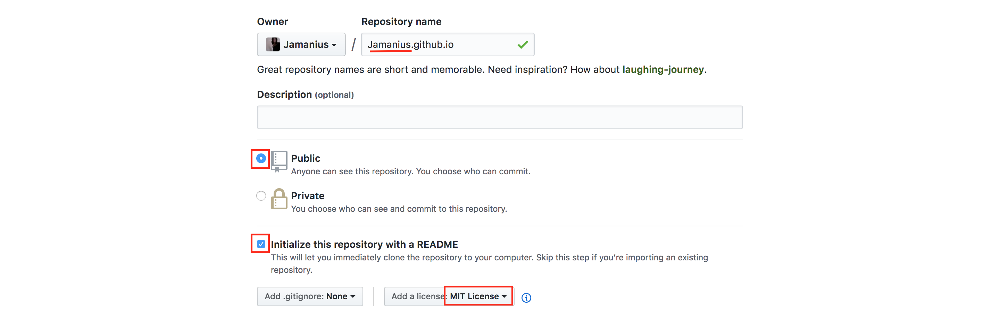
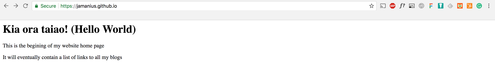

[Sprint 1 Home](README.md)|
---|

# Setup new Repo & Create Blog Challenge

## Learning Competencies
By the end of this you should be able to:

- Create a new repository
- Understand what GitHub pages are
- Have a skeletal framework to build your blog 


## Summary
Today you'll begin a blog that you'll work on throughout Foundations and you'll do so using a service called [GitHub Pages](https://pages.github.com/). You'll create a repo, clone a repo, add some files and push it up to GitHub Pages.


## Application

Application | Time|
------------|----------|
Create a website repository | 20 minutes 
Reflect | 15 minutes |


## Introduction 

The purpose of the blog is triple fold: 
- To continue honing your skills in GitHub workflow  
- To provide a home for assignments and reflections  
- To practice HTML, CSS and JS.  

It can be tempting to tinker for hours with the visual elements of your blog, but there is no award for best design. 

Stay focused, stay sharp. You're here to learn breadth, not depth. 

As always, keep your learning objectives in mind and hone your practice. Follow the timebox suggestions and reach out to the community if you feel blocked.


## Create a new Repo 
1. Create a [new repository](https://github.com/new) 
2. Use the syntax `username.github.io` for your repository name (example Figure 1)
3. Select the options shown in Figure 1

<figure>
  <figcaption>
    <p><strong>Figure 1:</strong> Preference setting for New GitHub repo</p>
  </figcaption>
  <br>
</figure>
  

## Clone Repo
__Important!__ Do not clone into an already existing repo (e.g. Foundations). 

Cloning to the same parent directory is fine, for example:  

Example: Good   
`User/Kiri/Dev-Academy/foundations`    
`User/Kiri/Dev-Academy/ko-wai-koe`  
`User/Kiri/Dev-Academy/jamanius.github.io` 

Example: Incorrect   
`User/Kiri/Dev-Academy/foundations/jamanius.github.io` 

1. Navigate to the directory where you want to clone your github.io repo
2. Clone it 


## Add a temporary index.html file 
1. Navigate __INTO__ the github.io repo 
2. Create a file called `index.html` (in command line type `touch index.html`
3. Open index.html with VS
3. Add this text to the index.html file and __save it__

```html
<html>
  <head>
    <title>My blog</title>
  <body>
    <h1>Kia ora Taiao! (Hello World!)</h1> 
    <p> This is the beginning of my website home page.</p>
    <p> It will eventually contain a list of links to all my blogs. </p>
  </body>
</html>

``` 
## Commit and Push 
_Note: After pushing to GitHub pages, there might be a delay - it can sometimes take 15 minutes to show on GitHub_

1. Commit and Push 
2. Check out your repo live by visiting `http://[USERNAME].github.io`* 


<figure>
  <figcaption>
    <p><strong>Figure 3:</strong> Example of Blog online.</p>
  </figcaption>
  <br>
</figure>


## Step 5: Reflect 
Open `my-reflections-sprint-1` and answer the following

1. Reflect on this sprint. What did you learn about your learning? 
2. What surprised you? 
3. Add, commit and push! 


