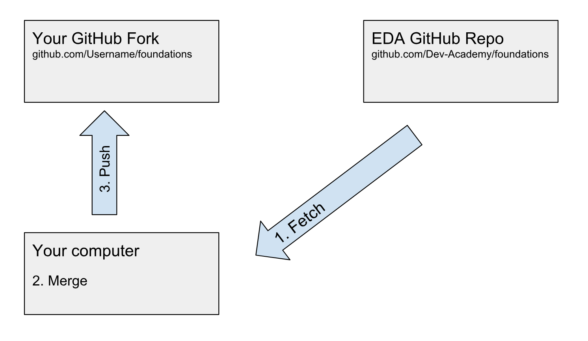
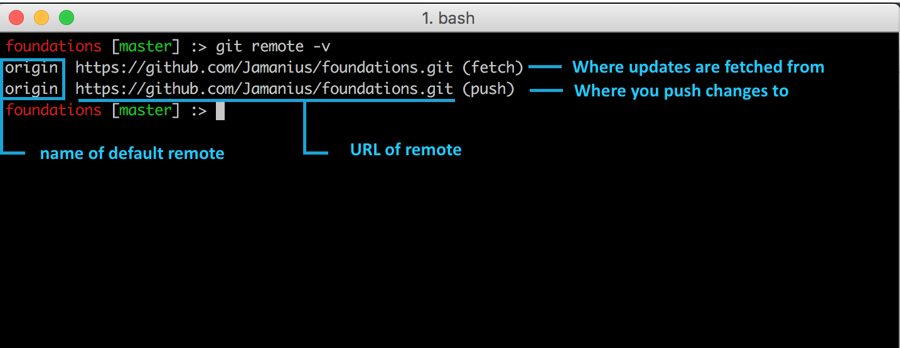

[Sprint 1 Home](README.md)|
---| 

# Git - Setting Remotes and Syncing Forks Challenge

### Learning Competencies
By the end of this challenge, you should be able to:

- Set up remotes in your forked repository
- Fetch changes 
- Understand how to keep forks in sync 

## Summary
When we make important updates to the curriculum, you'll need to tell Git how to get those changes. 
You'll do this by setting remotes, fetching and at merging changes into your own copy. 

## Timebox

Activity | Time|
------------|----------|
Refresh | 40 minutes
Add a remote | 10 minutes
Fetch changes | 10 minutes 
Reflect | 15 minutes |

Follow the timebox suggestions. If you get stuck, take a quick break and come back to it. Reach out to the community on slack. Remember to clarify and define what you are trying to do/solve. Break it down into steps

## Intro 
As a web developer you'll be working 90% of the time on a local version of a code base, using a text editor (like visual studio or sublime) to create and edit code. But code sitting isolated on your computer is of little value. You'll want to be able to contribute to code bases and keep your local versions in sync. 

You can do this by setting remotes.

## Refresh - Forking and updating a repo
In this refresher we refer to the EDA GitHub repo, however the workflow is universal for forking and updating any repo.

<figure>
   
</figure>

1. __Fork our repo:__ This is a GitHub operation, in which you are making a copy of our repository (including the files, commit history, issues, and more). This repository now lives in your GitHub account. Nothing has yet happened to your local computer.  

2. __Clone your repo:__ This is a Git operation, in which you are using Git to tell GitHub "please send me a copy of my repo." The repo is now stored on your local computer.  

3. __Update some files:__ You can now make updates to the files in whatever program or environment you like, or the recommended VS.

4. __Commit your changes:__ This is a Git operation, in which you are telling Git to record the file changes you have made. This is an operation on your local computer only.

5. __Push your changes to your GitHub repo:__ This is a Git operation, in which you are using Git to tell GitHub "here are my changes." Pushing does not happen automatically, so until you do this step, GitHub does not know about your commits.

6. __Send a pull request to EDA:__ If you think that EDA might like to incorporate your changes, you send us a pull request. This is a GitHub operation, in which you are communicating your changes to EDA, and "requesting" that EDA "pull" from your repo. It is up to EDA whether EDA pulls from you or not.

## Refresh - Syncing a Fork
Say that EDA and other contributors have made some more updates to the curriculum, and you've thought of some more updates you'd like to make. Before you do anything else, it's best to "sync your fork" so that you are working on the latest copy of the files. Here's what you do:

<figure>
   
</figure>

1. __Fetch changes from EDA's repo:__ This is a Git operation, in which you are using Git to tell GitHub that you would like to retrieve the latest files from EDA's repo.  

2. __Merge those changes into your repo:__ This is a Git operation, in which you are updating the repo on your local computer with those changes _(which have been temporarily stored in a "branch")_. __Note: Steps 1 and 2 are often combined into a single Git operation called a "pull."__  

3. __Push the updates to your GitHub repo (optional):__ Remember that your local computer does not automatically update your GitHub repo. Therefore, the only way to get your GitHub repo up-to-date is by pushing up the latest changes. You can either do this right away, or you can wait until you have made some updates of your own and committed them locally.

__Take note of the contrast between the workflow for forking and the workflow for syncing:__ When you initially fork a repo, the flow of information is from EDA's repo to your repo, and then down to your local computer. But after that initial process, the flow of information is from EDA's repo to your local computer, and then up to your repo.

Credit: [Inspired by DataSchool.io](https://www.dataschool.io/)

## Check your current remote
type `git remote -v`

When a repo is cloned, it has a default remote called __origin__ that points to __your fork__ on GitHub, not the original repo it was forked from. 

Study the image below and the output on your computer. Notice by default you fetch and push changes to the same remote. 

But what if you want to get changes from somewhere different (e.g. Dev Academy)?

<figure>
  <figcaption>
    
<strong>Figure 1:</strong> Example of Git remote (default) 

  </figcaption>
   
</figure>

## Add a new remote 
At times, you will need to be able to pull changes we make to the curriculum. The standard naming convention for this type of remote is called ['upstream'](https://opensource.stackexchange.com/questions/993/what-does-upstream-mean) but for simplicity, we're going to call it eda-remote. 

1. Add a new remote called `eda-remote` (hint: figure 2)

<figure>
  <figcaption>
    
<strong>Figure 2:</strong> Add new remote

  </figcaption>
   
</figure>

## Fetch / Pull Changes 
`git fetch` retrieves new work done by other people. Fetching from a repository grabs all the new remote-tracking branches and tags without merging those changes into your own branches. 

Git will ensure everything is kept if your files and our files are different and Git will ask you to manually decide which parts you want to keep. 

1. Check to see if there are changes on the eda-remote.
2. If there are, fetch them

__Useful commands:__      
`git diff origin/master eda-remote/master`    
`git remote show eda-remote`  

## Merge Changes 
1. Merge changes (hint: figure 3)

<figure>
  <figcaption>
    
<strong>Figure 3:</strong> A conversation with Git

  </figcaption>
   
</figure>

## Reflect
Edit your `my-reflections-sprint-1.md` file.  
_Pro-tip: Use terminal to navigate and open the file._ 

Reflection on:

1. What is a remote?
2. How are they set up?
3. How would you explain a remote to a non-technical person using an analogy?
4. Add, commit and push your reflection. 
