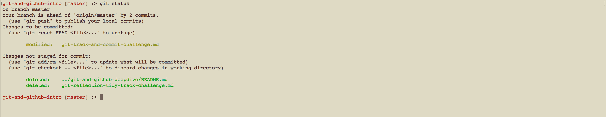
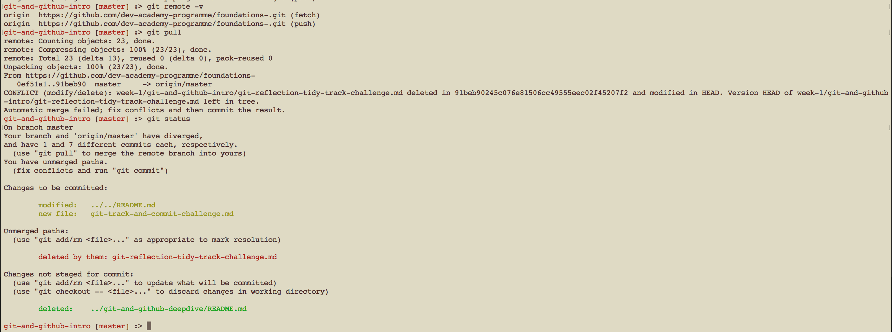

[Sprint 1 Home](README.md)|
---|

# Git Messages (Stretch Challenge)

## Learning Competencies

- Analyse Git command line messages

## Summary

Web Developers are problem solvers. And a great way to problem solve is to break the problem down into a series of small chunks and into plain english. 

Use the Git messages below to practice understanding Git and chunking down a problem. 

## Timebox

Activity | Time|
------------|----------|
Break it down  | 30 minutes
Seek | 30 minutes
Reflect | 20 minutes

## Break it down
Using plain english, for each image break down what is happening. 
What is the user trying to accomplish? What is the response?
Walk through it step by step, e.g.
'user checks status'
'status comes back with a conflict'
'user does xyz'

## Seek
If you don't recognise something, find out what it is. Are there new terms you don't recognise?

## Reflect
- Navigate to you `my-reflections-sprint-1.md` file in this directory 
- For each image, write your analysis of what is happening.
- Describe what you learned

<figure>
  <figcaption>
    
<strong>Figure 1:</strong>

  </figcaption>
   

</figure>

<figure>
  <figcaption>
    
<strong>Figure 2:</strong>

  </figcaption>
   

</figure>

<figure>
  <figcaption>
    
<strong>Figure 2:</strong>

  </figcaption>
   

</figure>