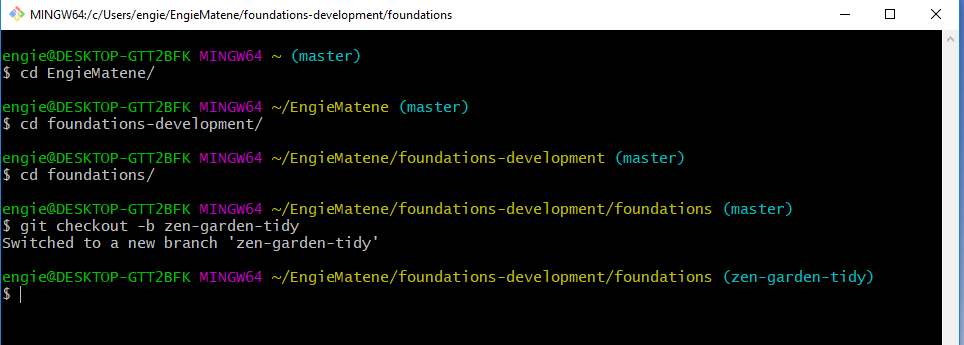

[Sprint 4 Home](README.md)|
---|

# Code Readability Challenge

### Learning Competencies 
By the end of the challenge, you should be able to:

- Create readable code by practicing indentation and formatting.

## Summary
Indenting and formatting your code is the first basic code readability skill you will need as a developer.

## Timebox

Activity | Time|
------------|----------|
Application | 50 minutes
Reflection | 10 minutes

## Instructions
_Use the files located within this Sprint 4 folder to follow along_

1. Open your terminal, navigate to your forked `foundations` repo and navigate to your `sprint-4` folder.
2. When you are get to your `sprint-4` folder, create a new branch called `zen-garden-tidy`.

<figure>
  <figcaption>
    
<strong>Figure 1:</strong> Creating a branch

  </figcaption>
   

</figure>

3. In terminal, list out the contents of your `sprint-4` folder and you should see a file called `zen-garden-untidy.html`.
4. Navigate to the `zen-garden-untidy.html` file and open your text editor.
5.  What you are going to find in this file has a whole lot of untidy code that is in need of a clean up.  Following the guidelines in [Formatting & Indenting Your HTML](https://www.granneman.com/webdev/coding/formatting-and-indenting-your-html), tidy up the code.
6.  Once you have finished tidying up the code, change the name of the file to `zen-garden-tidy.html`.

## Stage and push! 
Commit and push your changes to GitHub. 

7. Create new pull request from your `zen-garden-tidy` branch to your `master` branch (hint: Navigate repo on GitHub website and create the pull request from there).  
8. Your pull request will be reviewed with your facilitator at your next 1:1. 

## Reflect 
Navigate to your `my-reflections-sprint-4` file.
Answer the following questions:

- As a developer, how important do you think indenting is?
- Do you prefer tabs or spaces when indenting?
- What is your workspace like in real life? Clean? Messy? Is your code a reflection of that? Is your _downloads_ folder a reflection of that?

