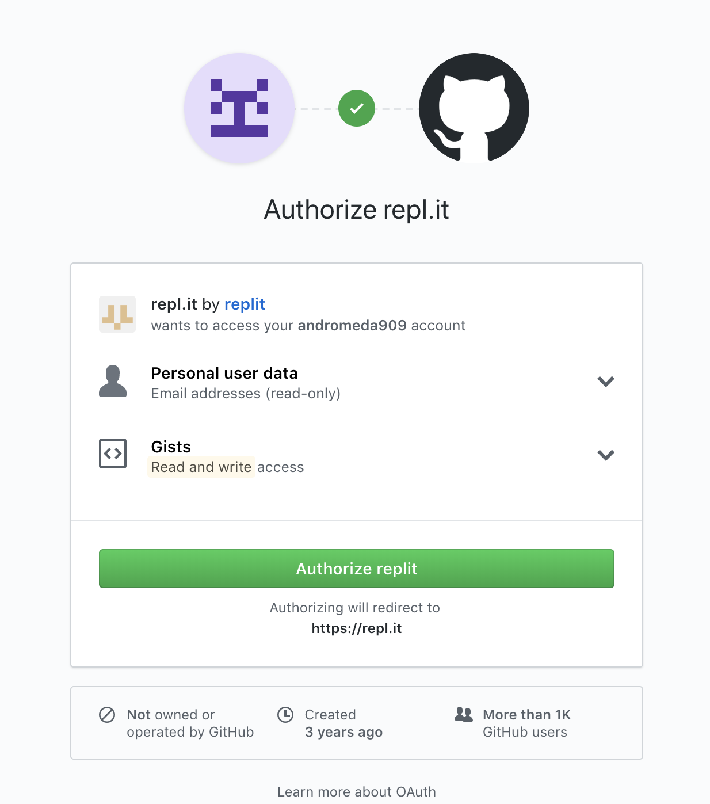
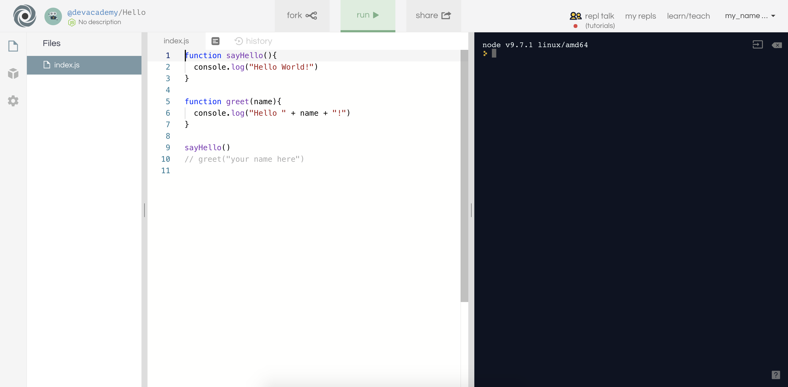

[Sprint 4 Home](README.md)

# Repl.it - Code in your browser
  
### Learning Competencies
By the end of this primer, you should be familiar with and able to:
>- ???

## Summary
During this sprint you will be using repl.it, a website that lets you run all sorts of code in your browser, in this case to run your challenges. Take this time to get yourself familiar with the site and how it works. It simulates what we will be doing from the computer in bootcamp, but without having to do any set up!

## Timebox

Activity | Time|
------------|----------|
Sign up | 30 minutes
Reflect | 10 minutes

## Description

`Repl.it` is a website that simulates a terminal and text editor, allowing you (the student) to get right into the code without needing to download or install further software (when you get to bootcamp, you will learn more about how to set this up on your own device, but for now - let's focus on learning more JavaScript!).

There are a whole bunch of programming languages that `repl.it` lets you run through the browser, including HTML/CSS. For our challenges though, we will be using `node.js` to write and then run our javascript files. 

## Sign Up

Before you start using the site, you will need to sign up so you can save your work. You can use this site without logging in (it will use the username anonymous instead), but you will lose any work that you do as it will only be saved for a short period of time.

#### Register

Navigate to the [sign up page](https://repl.it/signup) of `repl.it`. There are a couple of options you can use to log in, but we would recommend using your github account to do so. You can do this by clicking on the github logo above the sign up boxes and then accepting the prompt to authorise `repl.it` to access your github account.

<figure>
  
  
   
</figure>

Once your account is registered, it will save any work you do on the site to it automatically. Any projects saved to your account (called repls) will be viewable by others. If you go to the user account for [devacademy](https://repl.it/@devacademy), you can see we have a few repls in there already. 

#### Run a repl

On the page for devacademy, click on the [Hello](https://repl.it/@devacademy/Hello) repl to open it. This is a repl we created to run `node.js` code, and you can see we've already written some javascript in there.

There are three parts to the repl window. Left to right in our `node.js` repl they are: the files in this repl, the code in the current file, and the terminal.

<figure>
  
   
</figure>

We can run a repl by clicking on the green `run` button at the top of the page. Click it and prepare to be greeted!

#### Fork a repl

That greeting was not very specific. We want to update the repl to greet you by name instead. To do so we will need to change the file. It would be rather annoying if any user could come along and change that code you've worked so hard on, so this website uses something you will already be familiar with, `forking`.

Rather than letting you edit the file in someone else's repl, as soon as you start editing a file, a copy of the repl will be created in your own account. You can also click on the `fork` button at the top of the page to manually do this.

---

- update to greetname (that's better)
    - username change in header
- see repl in own account
- we can also create a project
    - choose language
    - name it
- update hello image above?

## Reflect