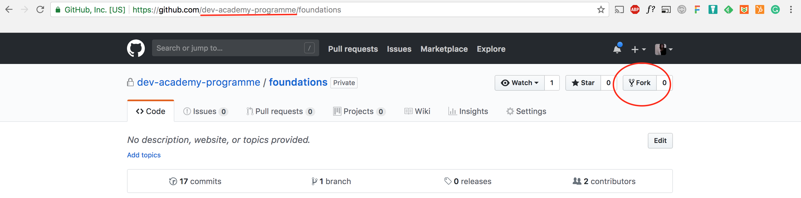
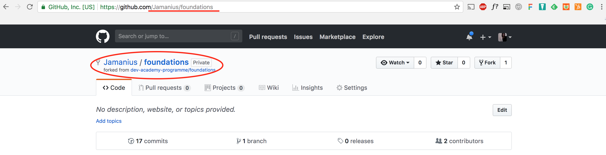

[Week 1 Home](../)

# Git and GitHub Challenge

### Learning Competencies
By the end of this exploration, you should be able to:

- Navigate repositories in GitHub
- Fork, clone a repository
- Push changes

## Summary
You will use this deep dive exploration to create your own forked version of this repo. You will then clone a copy to your machine. This clone is where you will be working on for the rest of your challenges. Changes that you make will not change the master EDA repo.

## Exploration and Application

Exploration | Time to box |
------------|----------|
Deep Dive | 1-2 hours
Reflect | 15 minutes |

Follow the time box suggestions. If you get stuck, take a quick break and come back to it. Reach out to the community on slack. Let the learning competencies be your guide.

## Pre-Requisites:
To complete this deep dive, you must have completed all [install instrutions](https://github.com/dev-academy-programme/orientation/tree/master/installation)

## Step 1: Fork
Create your own version of this repo by forking it. 

Origin: dev-academy-programme/foundations   
Destination: git-hub-user-name/foundations   

<figure>
  <figcaption>
    
<strong>Figure 1:</strong> Fork Repo from origin

  </figcaption>
   

</figure>

<figure>
  <figcaption>
    
<strong>Figure 1:</strong> View of Forked repo in destination 

  </figcaption>
   
</figure>

## Find out what it is
Explore what is Git? What is GitHub? What is GitHub user flow?

Here's some resources to get you going.
*[Git and GitHub article]()
*[Git and Github Crash Course Video (24 min)](https://www.youtube.com/watch?v=SWYqp7iY_Tc)

## Apply your knowledge

## Reflect
Reflecting is essential for solidifying your learning. Remember, reflections are for you, but they will also be read by others, so make sure to write for an audience.They should be only a paragraph long.

__In your reflection answer the questions:__
1. What was the most challenging for you in going through this material?
2. Did you complete all of the activities in the learning competencies?
3. In a couple of sentences, how would you describe the command line in plain english? Can you think of an analogy for it?
4. Did you stick to the timebox suggestions? If not, why not?
4. Any surprises e.g. Super useful resources

## Stretch Competencies
Come back to stretch competencies in your spare time. Don't focus on them now while you're getting started

**Intermediate Git'ers**
- [Learn Git Branching](http://pcottle.GitHub.io/learnGitBranching/) - basic Git commands and branching.
