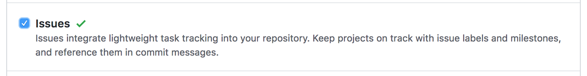
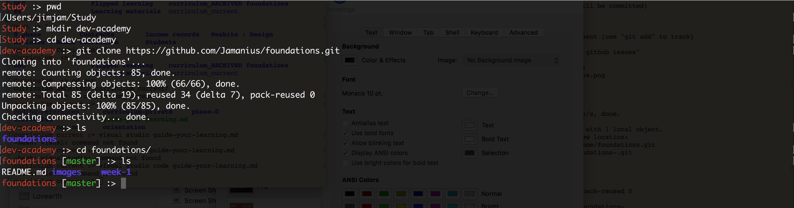
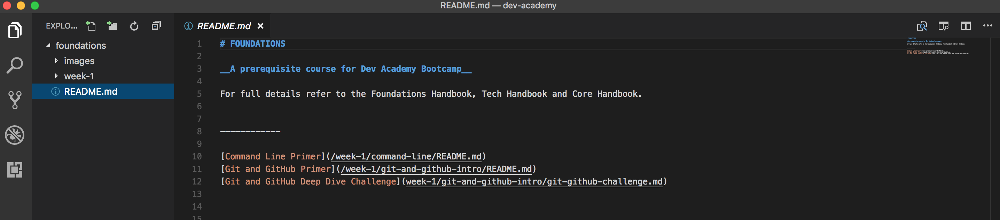

[Week 1 Home](../)

# Git and GitHub Challenge

### Learning Competencies
By the end of this exploration, you should be able to:

- Navigate repositories in GitHub
- Fork, clone a repository
- Push changes

## Summary
You will use this deep dive exploration to create your own forked version of this repo. You will then clone a copy to your machine. This clone is where you will be working on for the rest of your learning exploration and assessments. Changes that you make will not change the master EDA version.

## Exploration and Application

Exploration | Time to box |
------------|----------|
Deep Dive | 1-2 hours
Reflect | 15 minutes |

Follow the time box suggestions. If you get stuck, take a quick break and come back to it. Reach out to the community on slack. Let the learning competencies be your guide.

## Pre-Requisites:
To complete this deep dive, you must have completed all [install instrutions](https://github.com/dev-academy-programme/orientation/tree/master/installation)

## Step 1: Fork
Create your own version of this repo by forking it. 

Origin: dev-academy-programme/foundations   
Destination: git-hub-user-name/foundations   

<figure>
  <figcaption>
    
<strong>Figure 1:</strong> Fork Repo from origin

  </figcaption>
   

</figure>

<figure>
  <figcaption>
    
<strong>Figure 2:</strong> View of Forked repo in destination 

  </figcaption>
   
</figure>

## Step 2: Enable issues
On your fork, find the settings button and enable issues 

<figure>
  <figcaption>
    
<strong>Figure 3:</strong> Enable issues via settings 

  </figcaption>
   
</figure>

## Step 3: Cloning 
You may have to manually enter your __gitHub password__ in terminal, so make sure you know it before beginning this step.  

Right now your repository exists on GitHub, but in order to add or edit files using your text editor, you need it to exist on your computer. In git terms, this is called cloning a repository locally.

1. Click the clone button (copies link)

<figure>
  <figcaption>
    
<strong>Figure 4:</strong> Clone button 

  </figcaption>
   
</figure>

**Pro-tip: Do the following tasks using command line:** 

2. The link you copied will create a directory called 'foundations'. __Think about where you that directory to live.__  Is it for example in `desktop/dev-academy/foundations` or does it make more sense to have it on your root directory e.g. `users/hinemoana/foundations` ? This is your learning journey, so you decide what logic makes most sense. __Go ahead and create the directory.__  

3. In terminal navigate __INTO__ _the directory you selected/created_
4. Enter the command `git clone` and use keyboard shortcut `cmd v` (mac) or `ctrl v` (win) to paste 
5 Follow the username and password prompts if required. 

<figure>
  <figcaption>
    
<strong>Figure 5:</strong> Terminal commands for cloning 

  </figcaption>
   
</figure>

## Step 4: Open in Visual Studio
Visual studio is a text editor that you installed during inital setup. Open it and then open the foundations file you just cloned. 

<figure>
  <figcaption>
    
<strong>Figure 5:</strong> Local clone repo in text editor 

  </figcaption>
   
</figure>

## Step 5: Reflect 
From now on, you'll add your reflections to your __local repo__ and push them back up to your forked version on GitHub. 

__Pro-tip: use command line to hone your skills

1. Create a file called my_reflection.md in the `git_and_github_intro` directory (on your computer)
2. In Visual Studio record your reflections 

- Create your own step-by-step fork and clone instructions for later use
- Did you have any moments where it all clicked? What clicked?

3. Use [markdown](https://github.com/adam-p/markdown-here/wiki/Markdown-Cheatsheet) to add some distinction to your reflection file .

