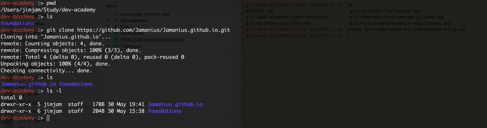

[Week 1 Home](../)

# git Setup New Repo, create GitHub pages Blog

## Learning Competencies
By the end of this you should be able to:

- Create a new repository
- Know what gitHub pages is 
- Have a skeletal framework to build your blog 


## Summary
Today you'll begin a blog that you'll continue to work on during Foundations. The challenge is designed as a walk through challenge to get you setup for future practice.

To build a blog, we'll you'll use a service called "GitHub pages".

The purpose of the blog is triple fold: 
- To continue honing your skills in GitHub workflow  
- To provide a home for assginments and reflections  
- To practice HTML, CSS and JS.  

When building your blog, you might find it really tempting to tinker around. The visual element adds an compelling layer of satisfaction (or disatisfaction) if certain aspects dont 'look' how you want them to. 

But don't be distracted. While this is your learning journey, we can tell you many students have fallen into the trap of loosing too much time tinkering. Stay focused, stay sharp. You're not here to learn everything or to go deep. Keep your learning objectives in mind and hone your practice. 


## Application

Application | Time to box |
------------|----------|
Create a website repository | 20 minutes 
Reflect | 15 minutes |

## Create a website repository (repo)
1. Create a [new repository](https://github.com/new) 
2. Add repository name with the following syntax: username.github.io  (Figure 1 _below_)  
3. Make sure the following options are selected: "Public, Initalise with README, Licence is MIT (Figure 1 _below_).  

## Clone the repo 
This step requires you to clone to your local compture. __Do not clone INTO your foundations__ directory. Git wont be happy if you put a clone within a clone. 

1. Think about where you want your clone to live and Clone the repo. You've got this - you've cloned [before!)](git-github-challenge.md#step-3-cloning). 

I cloned mine to a directory called `dev-academy`. Foundations is in the same directory (Figure 2 _below_)

Follow the time box suggestions. If you get stuck, take a quick break and come back to it. Reach out to the community on slack. Let the learning competencies be your guide.

## Add a temporary index.html file 
1. Navigate __INTO__ the directory and add a new file called `index.html` (Hint: Its just like using terminal to create an .md file or a .txt file.)
2. Open index.html with your text editor (e.g Visual Code) 
3. Add this text to the index.html file and __save it__

```html
<html>
  <body>
      Kia ora taiao! 
  </body>
</html>

``` 
## Commit and Push 
1. Use your git skills to stage your file, commit your changes and push to GitHub. 
2. Check out your repo live by visitng `http://[USERNAME].github.io`* 

_Note: it can take 15 minutes to show on GitHub sometimes_


<figure>
  <figcaption>
    <p><strong>Figure 1:</strong> Preference setting for New GitHub repo</p>
  </figcaption>
  <br>

</figure


<figure>
  <figcaption>
    <p><strong>Figure 2:</strong> Blog directory and terminal commands</p>
  </figcaption>
  <br>

</figure


<figure>
  <figcaption>
    <p><strong>Figure 3:</strong> My github pages blog online</p>
  </figcaption>
  <br>

</figure


## Step 5: Reflect
By now your relection file (`myreflection.md`) should contain a bunch of seperate paragaphs about your reflections. Hopefully it contains some [markdown](https://github.com/adam-p/markdown-here/wiki/Markdown-Cheatsheet) for titles and such. 

Add your reflections about the following. 

1. Explain how to create a repository on GitHub and clone the repository to your local computer to a non-technical person
2. What did you learn? What surprised you? 
3. Use [markdown](https://github.com/adam-p/markdown-here/wiki/Markdown-Cheatsheet) to add some distinction to your reflection file.
4. Add, commit and push! 


