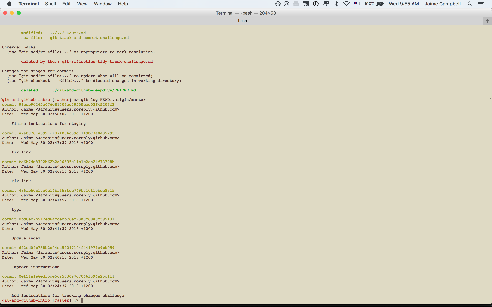

[Week 1 Home](../)

# GitHub and terminal error messages (Stretch Challenge)

## Learning Competencies

- Analyise git terminal messages

## Summary

To solve a problem, you must understand the problem. Git in the terminal displays important information. Your job will require that you are constantly solving problems, which means you need to hone your skills in discecting what the problem is.

## Exploration and Application

Exploration | Time to box |
------------|----------|
Break it down  | 30 minutes
Seek | 30 minutes
Reflect | 20 minutes

## Break it down
For each image, write in plain english break down what is happening. What is the user trying to accomplish? What is the response?
Walk through it step by step, e.g.
'user checks status'
'status comes back with a conflict'
'user does xyz'

## Seek
If you don't recognise something, find out what it is. Are there new terms you dont recognise?

## Reflect
- Create a my_reflection.md file in this directory (git-github-stretch)
- For each image, write your analyis of what is happening.
- Describe what you learned

<figure>
  <figcaption>
    
<strong>Figure 1:</strong>

  </figcaption>
   

</figure>

<figure>
  <figcaption>
    
<strong>Figure 2:</strong>

  </figcaption>
   

</figure>

<figure>
  <figcaption>
    
<strong>Figure 2:</strong>

  </figcaption>
   

</figure>