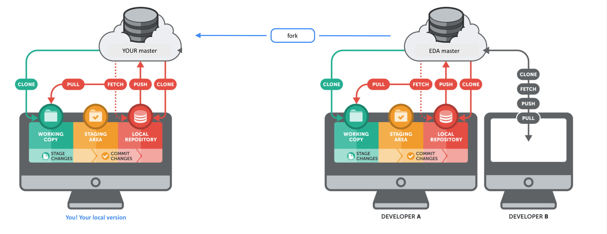

[Week 1 Home](README.md)

# Git Set Remotes and Merge Primer 

### Learning Competencies
By the end of this exploration, you should be able to 

- Explain what a remote is

## Summary
Git uses remote URLs to figure out where to go on the Internet to push and pull files. By setting a remote, you are basically telling git exactly where to go when you want to save (push) your work, get (pull) your work to your computer, or fetch changes from the repo you forked from.

## Exploration and Application

Exploration | Time to box |
------------|----------|
Refresh | 10 minutes
Explore | 20 minutes 
Reflect | 15 minutes |

## Refresh
1. You forked our repo (effectively creating your own version of it). 
2. You made a copy (clone) of that fork on your local computer.
3. You staged changes 
4. You pushed changes to __your__ forked repo. You did so on your own master branch. None of your changes are reflected on our repo. 

__Pro-tip__  When you are exploring git work flow, you will come across advice like 'don't push to master'. This is valid advice for when you don't have your own fork.

Keep in mind lots of material online are not talking from a forked context. You'll hear terms like 'branch' and 'pull requests' to 'merge' into (their) master. We'll cover that soon.  

Study this diagram, adapted from [GitTower](https://www.git-tower.com/learn/git/ebook/en/command-line/remote-repositories/introduction) (thanks GitTower!). 

<figure>
  <figcaption>
    
<strong>Figure 1:</strong> Left = YOUR Master, Right = OUR master

  </figcaption>
   

</figure>

## Explore 
Figure out what you need to know (learning objectives). 
Google your queries e.g. "what is a git remote" and or refer to the previous resources. 

## Reflect
Open your `my-reflections-week-1.md` file and answer the following. Don't forget to stage and commit.  

1. What is the difference between cloning from a forked and cloning from a non-forked repo. 
2. Can you think of an analogy to describe forking?
3. What is a remote? 
4. Did anything surprise you?

