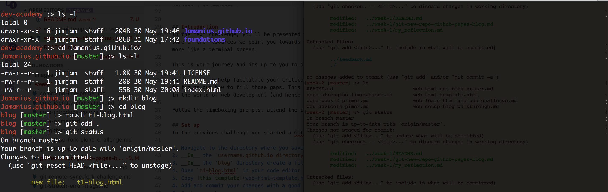
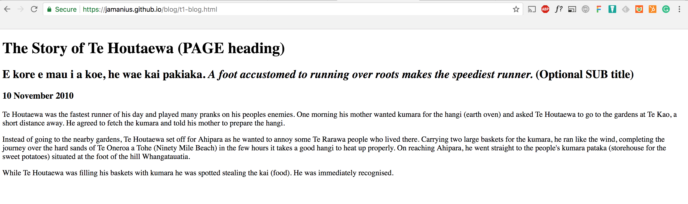

[Week 2 Home](README.md)

# Your Blog - primer and setup

### Learning Competencies
By the end of this primer, you should be able to 
- Understand the context for learning 
- Understand the purpose of your blog 
- Add a blog directory with template HTML

## Summary
This week is about getting familiar with HTML and CSS whilst honing your GitHub and command line skills. You'll be learning HTML and CSS through online resources and applying what you learn to your own blog website. 

You'll continue to build on your blog throughout the Foundations course. 

## Exploration and Application

Exploration | Time to box |
------------|----------|
Introduction | 10 minutes
Set up | 20 minutes |
Reflect | 10 minutes |

## Introduction 
Last week you set up the beginnings of your github pages blog (`username.github.io`). You'll be expanding this with HTML and CSS and JavaScript, as you learn new material and solve new challenges. 

The completion of your blog will go towards your Foundations assessment. However, its __really__ important to note that the assessment is not a like a website award competition, where first prize goes to the best looking site. Quite the contrary, we don't mind so much about what your blog looks like, but rather _how_ you engaged with the material; the quality of your reflections; How you identified obstacles and overcame them; whether you can demonstrate an understanding of the concepts and learning objectives; how frequently you engaged and staged commits.  

What your Blog is: A space where you demonstrate your skills in problem solving and reflections. 
What your Blog is not: A fancy looking, perfectly put together interface. 

Throughout the weeks, you'll be presented with bunch of ways to learn HTML, CSS and JS building blocks. 
Some of the resources we point you towards will be media rich with audio and video. Other's, like freeCodeCamp, will look more like a terminal screen. 

__This is your journey and its up to you to discern how you learn best.__ 

Our role is to help you by facilitating your critical thinking: help you to understand where your knowledge gaps are, and prompt you to figure out how to fill those gaps. This type of learning is different from being given a set of instructions to follow. In the world of web development (and hence problem solving) your greatest asset in knowing how to work something out. 

Follow the timeboxing prompts, attend the check-in's, keep to the learning objectives and reflect. 
 
## Set up 
In the previous challenge you started a GitHub pages blog `username.gihub.io`. 

1. Navigate to the directory where you saved your `username.github.io` repo
2. __In__ the `username.github.io directory, create a new directory called `blog` (hint: mkdir)
3. __In__ the `blog` directory create a file t1-blog.html (hint: touch)
4. Open `t1-blog.html` in your code editor (hint code .)
5. Copy [this template](web-html-template.html) and paste it into `t1-blog.html`.
4. Add and commit your changes with a good commit message 
5. Push your changes 
6. Visit your page on your web browswer `username.github.io/blog/t1-blog.html`

## Reflect
Navigate to your `my-reflections-week-2` file (Pro-tip: Use terminal. Ask "where am I, where do I need to be, how do I get there)

Describe what you did in this exercise. Did you understand the steps that you were making? Can you describe them in simple lay terms?

Did you achieve the learning competencies and keep within the timebox?

Save stage and push your changes. 

## Visual references 

<figure>
  <figcaption>
    
<strong>Figure 1:</strong> Add blog directory

  </figcaption>
   
</figure>

<figure>
  <figcaption>
    
<strong>Figure 2:</strong> The final product - template in browser

  </figcaption>
   
</figure>